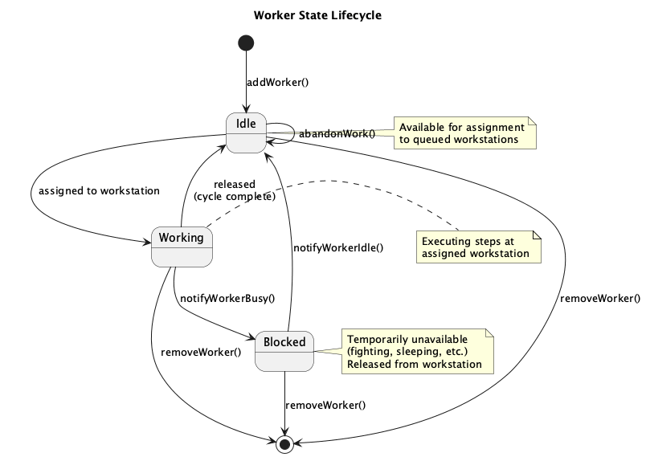
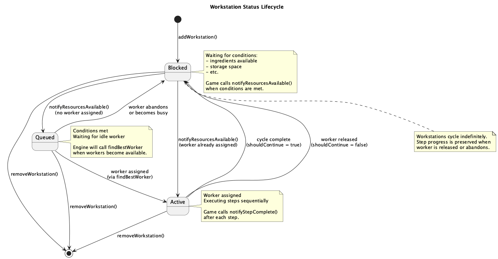
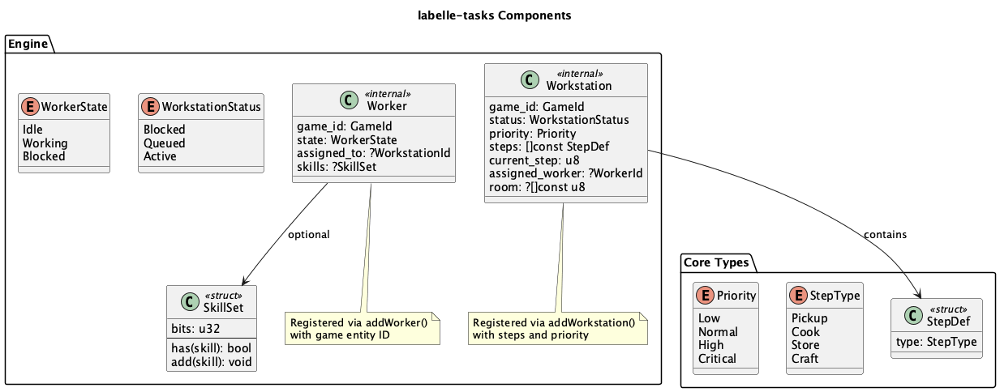
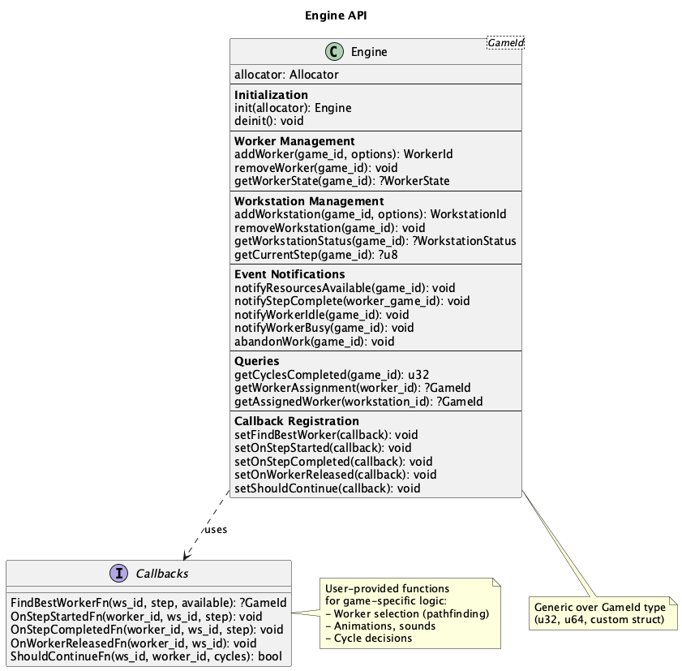
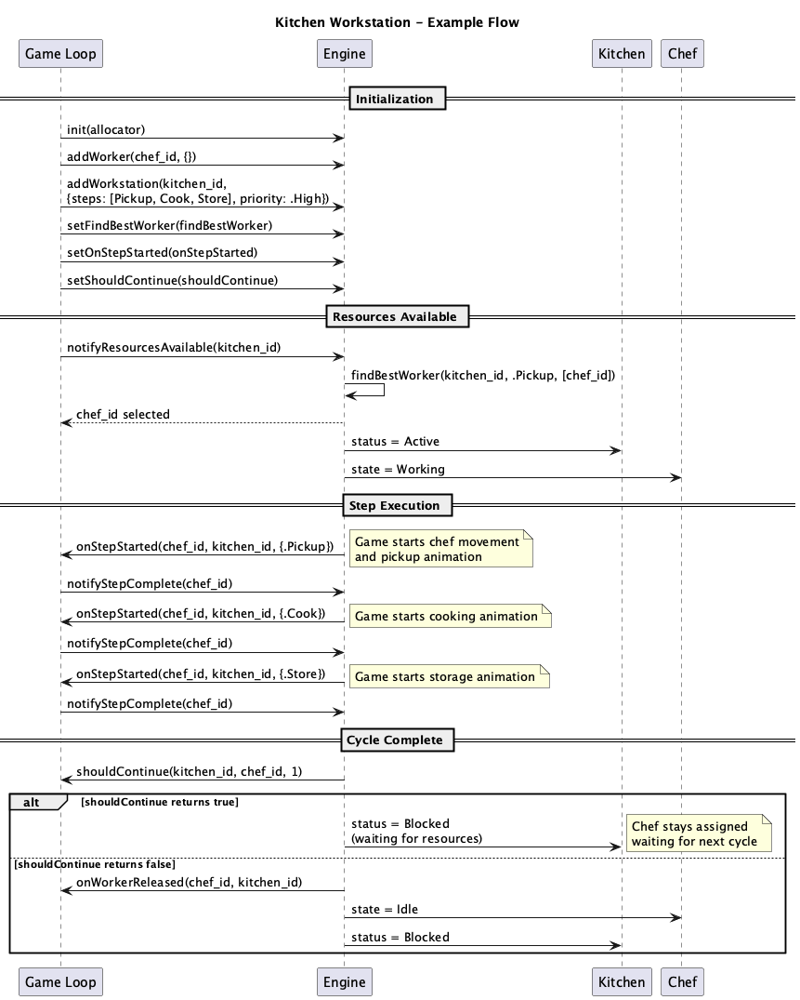
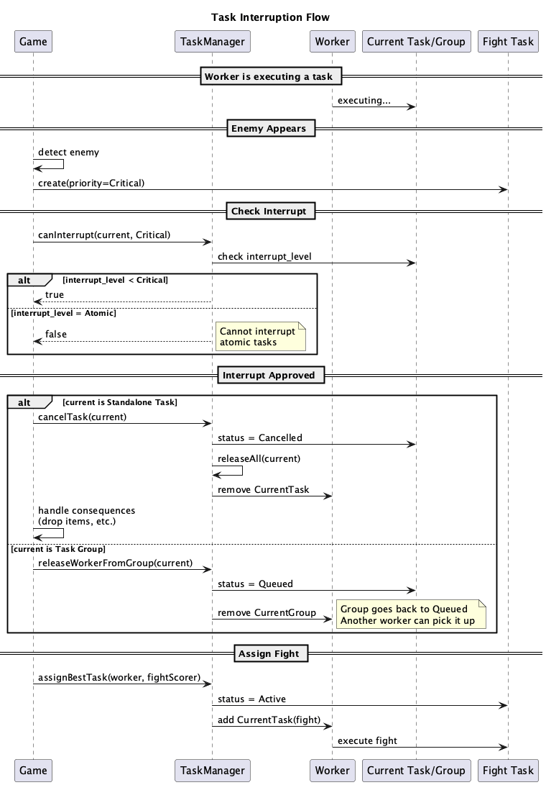

# labelle-tasks

Task orchestration engine for Zig games. Part of the [labelle-toolkit](https://github.com/labelle-toolkit).

## Overview

A self-contained task orchestration engine for managing workers and workstations in games. The engine handles task assignment and progression internally, while games provide callbacks for game-specific logic (pathfinding, animations, etc.).

## Features

- **Priority-based assignment** - Workstations have priorities (Low, Normal, High, Critical)
- **Multi-step workflows** - Workstations define sequences of steps (Pickup, Cook, Store, Craft)
- **Worker management** - Workers are assigned to workstations automatically
- **Cycle tracking** - Track how many times a workstation has completed its workflow
- **Step preservation** - When workers abandon work, step progress is preserved
- **Callback-driven** - Game controls execution via callbacks, engine manages state

## Concepts

### Workers

Entities that perform work at workstations. Workers have three states:
- **Idle** - Available for assignment
- **Working** - Executing steps at a workstation
- **Blocked** - Temporarily unavailable (fighting, sleeping, etc.)

### Workstations

Locations where work happens. Each workstation defines a sequence of steps. Workstations have three statuses:
- **Blocked** - Waiting for resources/conditions
- **Queued** - Ready for work, waiting for a worker
- **Active** - Worker assigned and executing steps

### Steps

Units of work within a workstation workflow:
- **Pickup** - Get items from a source
- **Cook** - Process at the workstation
- **Store** - Put items to a destination
- **Craft** - Create new items

## Worker Lifecycle



## Workstation Lifecycle



Workstations cycle indefinitely. When all steps complete, the workstation returns to Blocked, waiting for conditions to be met again.

## Components



## Engine API



```zig
const tasks = @import("labelle_tasks");

// Create engine with your game's entity ID type
var engine = tasks.Engine(u32).init(allocator);
defer engine.deinit();

// Register callbacks
engine.setFindBestWorker(findBestWorker);
engine.setOnStepStarted(onStepStarted);
engine.setOnStepCompleted(onStepCompleted);
engine.setOnWorkerReleased(onWorkerReleased);
engine.setShouldContinue(shouldContinue);

// Register workers
_ = engine.addWorker(chef_id, .{});

// Register workstations
const steps = [_]tasks.StepDef{
    .{ .type = .Pickup },
    .{ .type = .Cook },
    .{ .type = .Store },
};
_ = engine.addWorkstation(kitchen_id, .{
    .steps = &steps,
    .priority = .High,
});

// Game events
engine.notifyResourcesAvailable(kitchen_id);  // Resources ready
engine.notifyStepComplete(chef_id);           // Step finished
engine.notifyWorkerIdle(chef_id);             // Worker available
engine.notifyWorkerBusy(chef_id);             // Worker unavailable
engine.abandonWork(chef_id);                  // Worker abandons task
```

## Callbacks

The engine uses callbacks to integrate with game-specific logic:

```zig
/// Find the best worker for a workstation
/// Return null if no suitable worker available
fn findBestWorker(
    workstation_id: u32,
    step: tasks.StepType,
    available_workers: []const u32,
) ?u32 {
    // Use pathfinding, skills, etc. to pick best worker
    return available_workers[0];
}

/// Called when a step starts - trigger movement/animation
fn onStepStarted(
    worker_id: u32,
    workstation_id: u32,
    step: tasks.StepDef,
) void {
    // Start worker movement, animation, etc.
}

/// Called when a step completes
fn onStepCompleted(
    worker_id: u32,
    workstation_id: u32,
    step: tasks.StepDef,
) void {
    // Update UI, play sounds, etc.
}

/// Called when worker is released from workstation
fn onWorkerReleased(
    worker_id: u32,
    workstation_id: u32,
) void {
    // Reassign worker, update UI, etc.
}

/// Called when cycle completes - should worker continue?
fn shouldContinue(
    workstation_id: u32,
    worker_id: u32,
    cycles_completed: u32,
) bool {
    // Return true to keep worker assigned for next cycle
    return cycles_completed < 5;
}
```

## Usage Examples

### Kitchen Workflow



```zig
const tasks = @import("labelle_tasks");

var engine = tasks.Engine(u32).init(allocator);
defer engine.deinit();

// Setup callbacks
engine.setFindBestWorker(findBestWorker);
engine.setOnStepStarted(onStepStarted);

// Register chef
_ = engine.addWorker(CHEF_ID, .{});

// Register kitchen with cooking workflow
const cooking_steps = [_]tasks.StepDef{
    .{ .type = .Pickup },  // Get ingredients
    .{ .type = .Cook },    // Cook at stove
    .{ .type = .Store },   // Store finished food
};
_ = engine.addWorkstation(KITCHEN_ID, .{
    .steps = &cooking_steps,
    .priority = .High,
});

// When ingredients become available
engine.notifyResourcesAvailable(KITCHEN_ID);
// Engine calls findBestWorker, assigns chef, calls onStepStarted

// When chef completes each step (from game animation/timer)
engine.notifyStepComplete(CHEF_ID);
// Engine advances to next step, calls onStepStarted

// After all steps complete, engine calls shouldContinue
// If true: kitchen goes to Blocked, chef stays assigned
// If false: chef released, can work elsewhere
```

### Worker Abandonment



```zig
// Chef is cooking when enemy appears
engine.abandonWork(CHEF_ID);
// Chef becomes Idle, kitchen goes to Blocked
// Kitchen preserves current step progress

// Handle fight outside of task engine...

// After fight, chef is available again
engine.notifyWorkerIdle(CHEF_ID);

// When kitchen has resources again
engine.notifyResourcesAvailable(KITCHEN_ID);
// Another worker (or same chef) can resume from preserved step
```

### Priority-Based Assignment

```zig
// Low priority farm
_ = engine.addWorkstation(FARM_ID, .{
    .steps = &farming_steps,
    .priority = .Low,
});

// High priority kitchen
_ = engine.addWorkstation(KITCHEN_ID, .{
    .steps = &cooking_steps,
    .priority = .High,
});

// When worker is released, engine assigns to highest priority
// queued workstation first
```

### Multi-Cycle Workflows

```zig
fn shouldContinue(ws_id: u32, worker_id: u32, cycles: u32) bool {
    // Keep worker at kitchen for up to 5 cycles
    if (ws_id == KITCHEN_ID) {
        return cycles < 5;
    }
    // One cycle for other workstations
    return false;
}

engine.setShouldContinue(shouldContinue);
```

## Running Examples

```bash
# Run all examples
zig build examples

# Run individual examples
zig build simple        # Priority-based workstation selection
zig build kitchen       # Multi-step workflow with priority
zig build abandonment   # Worker abandonment with step preservation
zig build multicycle    # Multi-cycle workflows with shouldContinue
zig build multiworker   # Multiple workers on multiple workstations
```

## Design Philosophy

- **Self-contained engine** - No external ECS dependency, manages state internally
- **Callback-driven** - Engine handles orchestration, game handles execution
- **Game entity IDs** - Engine is generic over ID type (u32, u64, custom struct)
- **Step preservation** - Abandoned work can be resumed by any worker
- **Workstations cycle** - They represent ongoing workflows, not one-off tasks

## License

MIT
